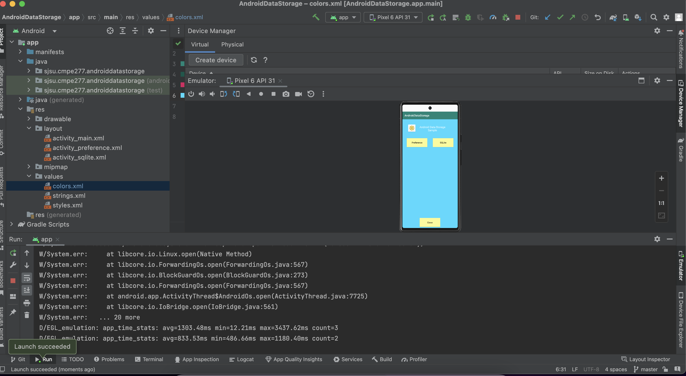
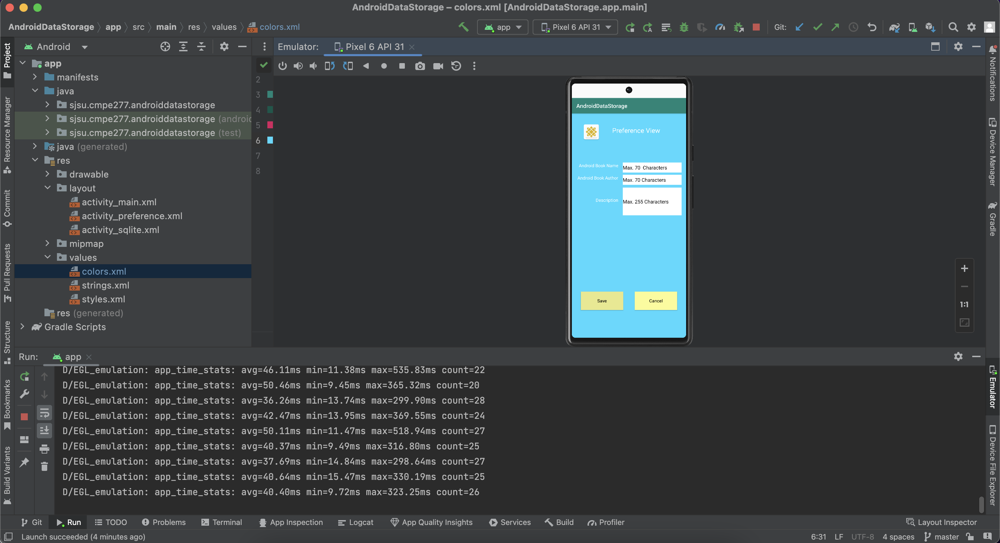
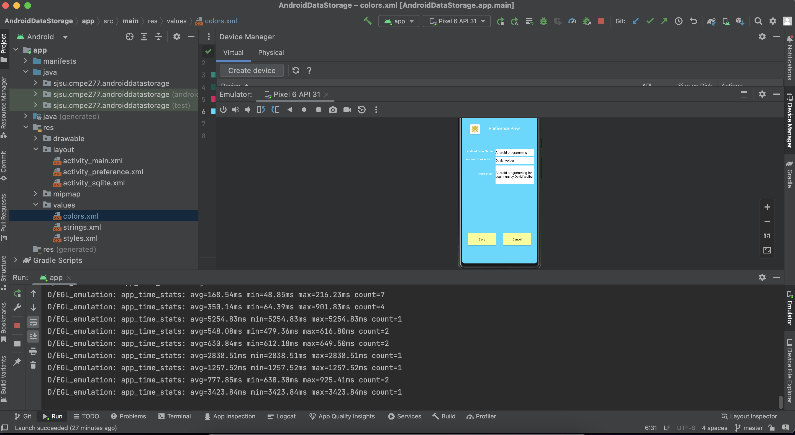
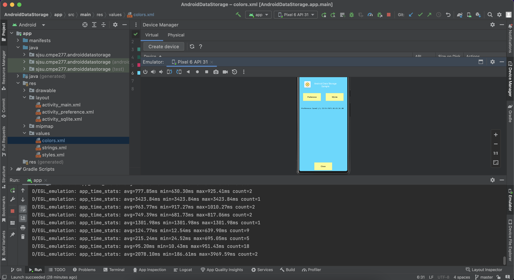
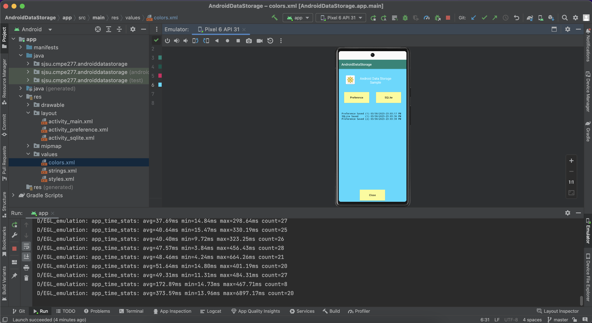

### cmpe277_storageapp
### Course: Smartphone Application Development

### Learning Objective:
Learning Objective: use android file and SQLite storage features to complete the assignment.

### Main Activity:

### Preference View :

### SQLlite View :

### Main activity screen after using preference and SQLlite views 

